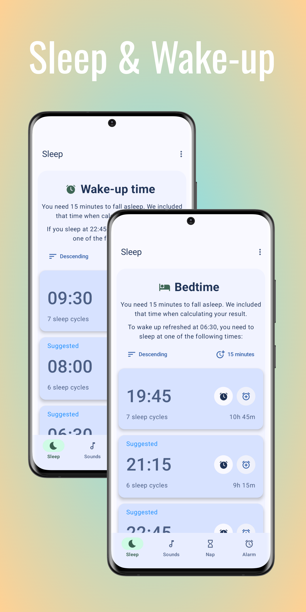
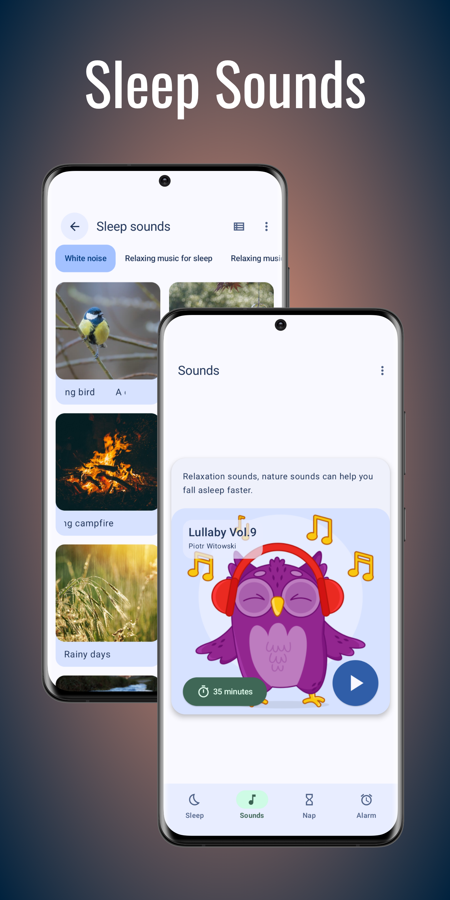
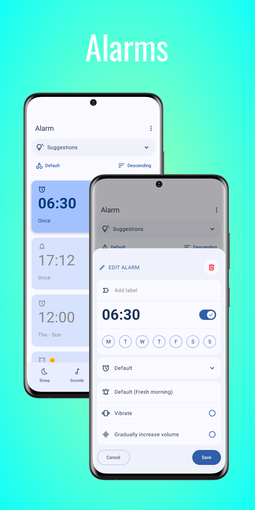
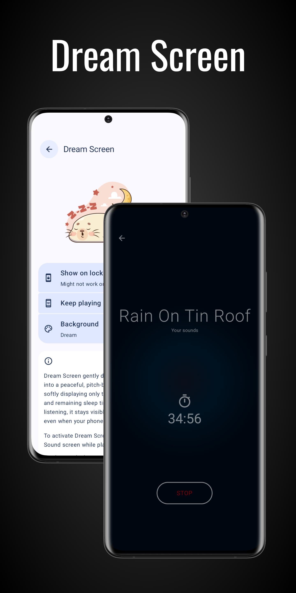
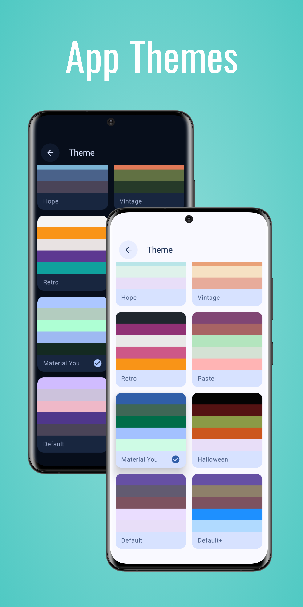
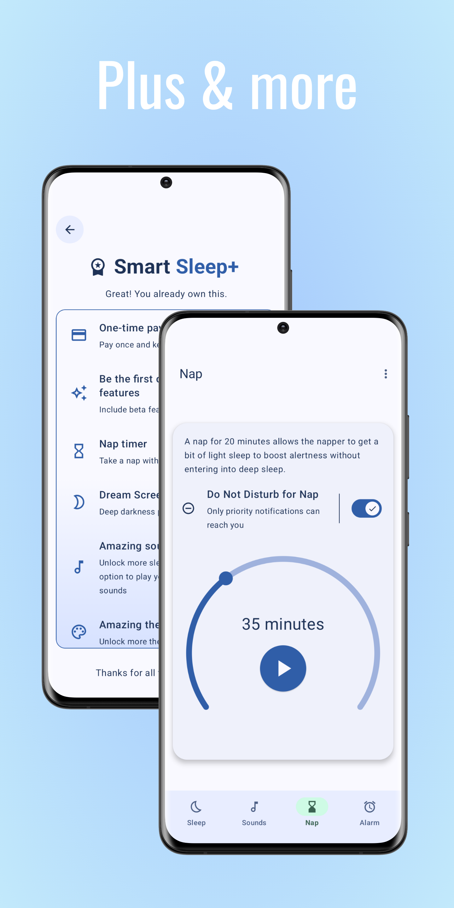

# Smart Sleep

Smart Sleep is an Android app that can calculate sleep cycle so you can estimate the time you need to go to bed or wake up. It has some extra features as well.

A good day starts with a good sleep. A good sleep should consist of 5-6 complete sleep cycles. To wake up refreshed, you need to sleep and wakeup at correct time.

Smart Sleep can calculate sleep cycle so you can estimate the time you need to go to bed or wake up. You don't need to open Clock app because you can set alarm right in Smart Sleep. This app can also help you fall asleep faster with nature and relaxation sounds.

 

  
  
  

  
  
  

## Demo
Watch [demo](https://youtu.be/s382DU-VxZ0)

## Features
- Calculate sleep cycles and optimal sleep times
- Determine ideal wake-up and bedtimes
- Customize sleep cycle length and fall asleep duration
- Play soothing relaxation and nature sounds (4 new collections)
- Fully customizable in-app alarm
- Gentle Wake (beta)
- Multiple themes and colors (more themes with Smart Sleep+)
- Material You (Android 12+)
- Themed icon (Android 13+)
- Large screen device compatibility
- Support multiple languages
- Effortless and intuitive to use
- No internet connection required

For more features, you can upgrade to Smart Sleep+.

## Smart Sleep+

Why should you get Smart Sleep+ (one-time payment):
- Pay once and keep forever
- Nap Timer: Take a nap without disturbance
- Dream Screen: Deep darkness player view
- Option to calculate bedtime/wake-up time directly from calculation result
- Option to show quick actions on top of calculation result
- Extra sleep and relaxation songs 
- Best sound quality (320 kbps) for recorder
- Option to play your own sounds
- Option to remember last played music and stop timer
- Option to extend stop timer
- Option to keep playing screen on
- Volume booster option
- 3 extra Gentle Wake sounds
- Option to set default value for new alarms (vibrate & gradually increase volume)
- Option to hide alarm tab
- Alarm volume slider directly in setting
- Option to show live preview of theme
- 5 extra app themes
- Option to hide tabs' name
- Support future development
- Be the first one to get latest features

## Changelog
Read app [changelog](changelog.md)

## Privacy policy
Read our [privacy policy](privacy.md)

## Terms of service
Read our [terms](terms.md)

## Found bugs?
Submit issue [here](https://github.com/ClearAll2/SmartSleepApp/issues/new)

## Translation
Learn how to translate [here](translations.md)

## Support
You can support me by downloading this app from [Play Store](https://play.google.com/store/apps/details?id=com.lkonlesoft.smartsleep) and sharing it to your friends.

## Donate
If you like my work and want to help, buy me a coffee at [PayPal](https://paypal.me/clearall2?country.x=VN&locale.x=en_US).

## This project is made possible by
- [Jetpack Compose Tutorial](https://www.jetpackcompose.net/)
- [Circular SeekBar](https://github.com/ningyuv/CircularSeekBar?ref=androidexample365.com)
- [Don't kill my app](https://dontkillmyapp.com/)
- [Flaticon](https://www.flaticon.com/)
- [Pixabay](https://pixabay.com/)
- [Music by Piotr Witowski from Pixabay](https://pixabay.com/users/17430502/)
- [Music by Alex Wit from Pixabay](https://pixabay.com/users/light_music-40074088/)

© 2026 [LKONLE](mailto:lkonle@proton.me), and published to [Google Play Store](https://play.google.com/store/apps/details?id=com.lkonlesoft.smartsleep).
