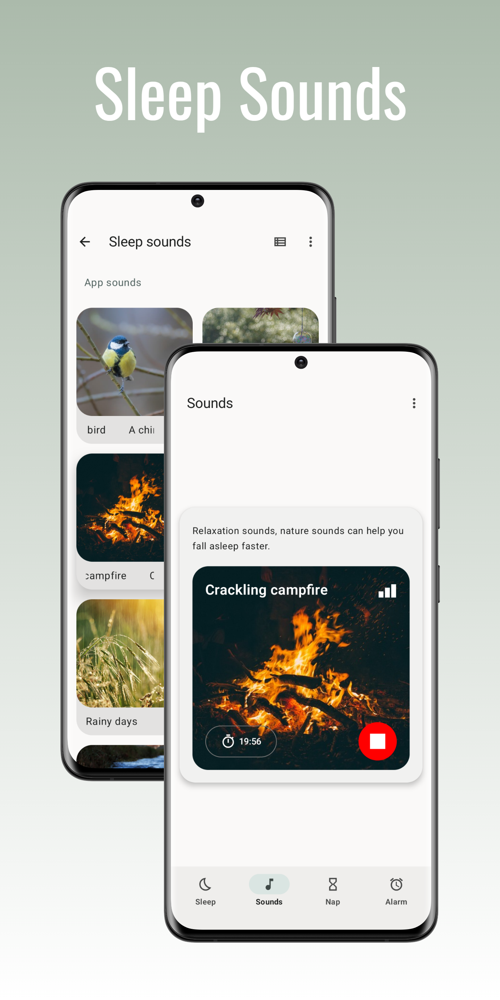
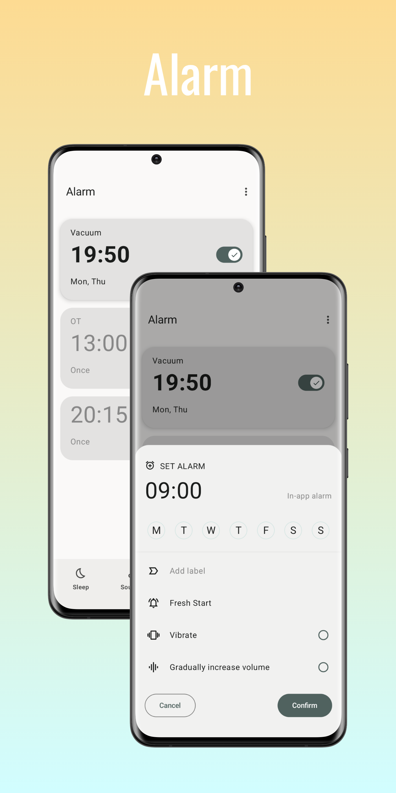
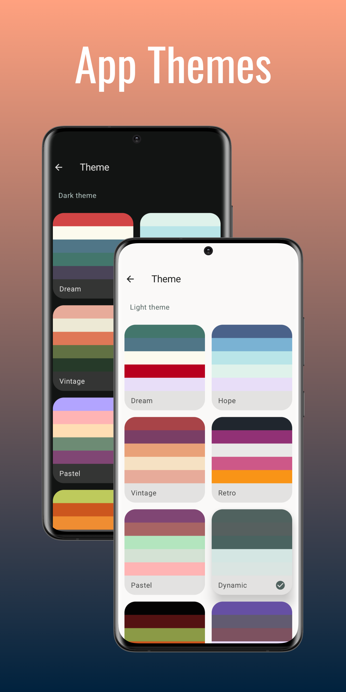

# Smart Sleep

Smart Sleep is an Android app that can calculate sleep cycle so you can estimate the time you need to go to bed or wake up. It has some extra features as well.

 

  
  
  
  

  
  
  
  

## Features
- [Sleep Calculator](calculator.md)
- [Sleep Sounds](sounds.md)
- [Nap timer](nap.md) (plus only)
- Schedule alarm
- Support dark/light theme
- Support Material You (Android 12+)
- Support themed icon (Android 13+)
- Support large screen devices

This app contains ads but you can get rid of them by upgrading to Smart Sleep+

## Smart Sleep+
Why should you get Smart Sleep+ (one-time payment):
- Ads free
- Unlock all settings and features
- Support future development
- Be the first one to get latest features

## Privacy policy
Read our privacy policy [here](privacy.md)

## Found bugs?
Submit issue [here](https://github.com/ClearAll2/SmartSleepApp/issues/new)

## Translation
You can help me by translating text in [string.xml](https://github.com/ClearAll2/SmartSleepRepo/blob/main/strings.xml) file

## Support
You can support me by downloading this app from [Play Store](https://play.google.com/store/apps/details?id=com.lkonlesoft.smartsleep) and sharing it to your friends.

## Donate
If you like my work and want to help, buy me a coffee at [PayPal](https://paypal.me/clearall2?country.x=VN&locale.x=en_US).

## This project is made possible by
- [Jetpack Compose Tutorial](https://www.jetpackcompose.net/)
- [Circular SeekBar](https://github.com/ningyuv/CircularSeekBar?ref=androidexample365.com)
- [M3 DateTime Pickers](https://github.com/marosseleng/compose-material3-datetime-pickers)
- [Don't kill my app](https://dontkillmyapp.com/)
- [Flaticon](https://www.flaticon.com/)
- [Pixabay](https://pixabay.com/)

© 2023 [LKONLE](https://t.me/lkonle), and published to [Google Play Store](https://play.google.com/store/apps/details?id=com.lkonlesoft.smartsleep).
