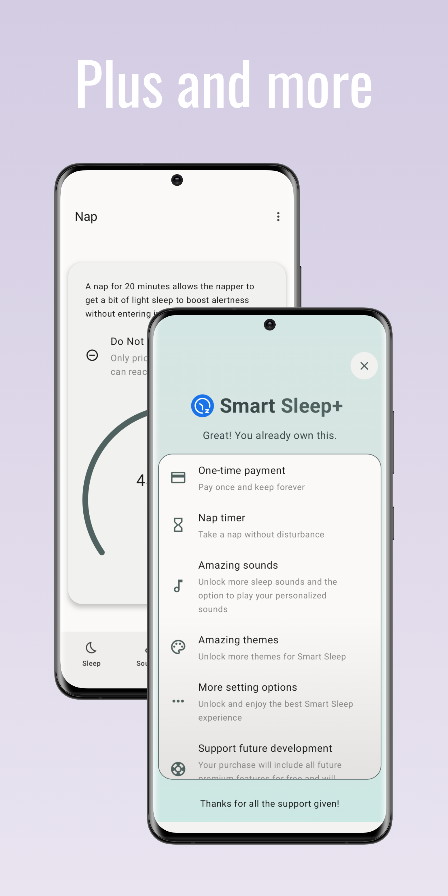

# Smart Sleep

Smart Sleep is an Android app that can calculate sleep cycle so you can estimate the time you need to go to bed or wake up. It has some extra features as well.

A good day starts with a good sleep. A good sleep should consist of 5-6 complete sleep cycles. To wake up refreshed, you need to sleep and wakeup at correct time.

Smart Sleep can calculate sleep cycle so you can estimate the time you need to go to bed or wake up. You don't need to open Clock app because you can set alarm right in Smart Sleep. This app can also help you fall asleep faster with nature and relaxation sounds.

 

  
  
  

  
  

## Demo
Watch [demo](https://youtu.be/s382DU-VxZ0)

## Features
- Calculate sleep cycle and sleep time
- Calculate time to wake up and time to sleep
- Adjust sleep cycle length and time to fall asleep
- Play relaxation and nature sounds
- Nap timer (Smart Sleep+)
- In-app alarm with full customization
- Gentle Wake (beta)
- Multiple themes and colors (more themes with Smart Sleep+)
- Material You (Android 12+)
- Themed icon (Android 13+)
- Support large screen devices
- Supports multiple languages
- Effortless and intuitive to use
- No need internet connection

For more features, you can upgrade to Smart Sleep+.

## Smart Sleep+

Why should you get Smart Sleep+ (one-time payment):
- Pay once and keep forever
- Nap Timer: Take a nap without disturbance
- Amazing sounds and the option to play your personalized sounds
- Amazing Gentle Wake sounds for the best wake-up experience
- Amazing themes
- More setting options for the best experience
- Support future development
- Be the first one to get latest features

## Changelog
Read app [changelog](changelog.md)

## Privacy policy
Read our [privacy policy](privacy.md)

## Terms of service
Read our [terms](terms.md)

## Found bugs?
Submit issue [here](https://github.com/ClearAll2/SmartSleepApp/issues/new)

## Translation
Learn how to translate [here](translations.md)

## Support
You can support me by downloading this app from [Play Store](https://play.google.com/store/apps/details?id=com.lkonlesoft.smartsleep) and sharing it to your friends.

## Donate
If you like my work and want to help, buy me a coffee at [PayPal](https://paypal.me/clearall2?country.x=VN&locale.x=en_US).

## This project is made possible by
- [Jetpack Compose Tutorial](https://www.jetpackcompose.net/)
- [Circular SeekBar](https://github.com/ningyuv/CircularSeekBar?ref=androidexample365.com)
- [M3 DateTime Pickers](https://github.com/marosseleng/compose-material3-datetime-pickers)
- [Don't kill my app](https://dontkillmyapp.com/)
- [Flaticon](https://www.flaticon.com/)
- [Pixabay](https://pixabay.com/)

© 2025 [LKONLE](mailto:lkonle@proton.me), and published to [Google Play Store](https://play.google.com/store/apps/details?id=com.lkonlesoft.smartsleep).
