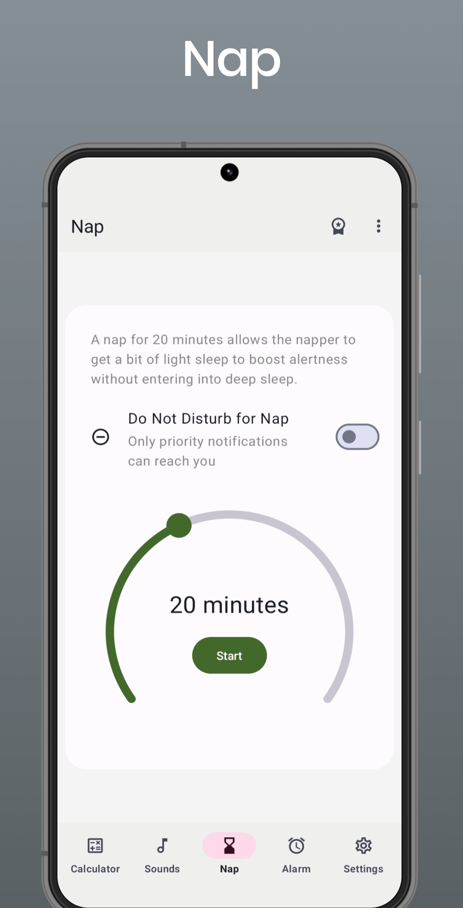

# Nap

A nap for 20 minutes allows the napper to get a bit of light sleep to boost alertness without entering into deep sleep.

  

© 2023 [LKONLE](https://t.me/lkonle), and published to [Google Play Store](https://play.google.com/store/apps/details?id=com.lkonlesoft.smartsleep).
